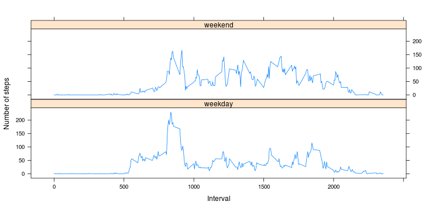

This is a project report written on Coursera's Reproducible Research course.

## Loading and preprocessing the data

I downloaded and unzipped the data manually and then read it into R.


```r
activityFull <- read.csv('activity.csv')
```


## What is mean total number of steps taken per day?

Drop any rows containing na values

```r
activity <- na.omit(activityFull )
```

First load dplyr. After grouping by date each day's total steps are calculated with summarise_each.


```r
library(dplyr)
activity1 <- group_by(activity, date) 
stepsum <- summarise_each(activity1, funs(sum), steps)
```

Here's the histogram:

```r
hist(stepsum$steps)
```

 

Mean and median of total steps per day.

```r
mean(stepsum$steps)
```

```
## [1] 10766.19
```

```r
median(stepsum$steps)
```

```
## [1] 10765
```

## What is the average daily activity pattern?

Summing intervals steps over days and calculating average number of steps in each interval by dividing by number of days (53)

```r
activity1 <- group_by(activity, interval)
aveStepByInterval <- summarise_each(activity1, funs(sum), steps)
aveStepByInterval$steps <- aveStepByInterval$steps /53
```

Plotting the time line: 

```r
plot(aveStepByInterval, type = "l")
```

 

Maximum number of steps on average are taken during interval 835, 206.1698 steps on average.


```r
max(aveStepByInterval$steps)
```

```
## [1] 206.1698
```


## Imputing missing values

There are 17568 rows in the dataset. After removing NA's there are 17568 rows. The total number of missing values is 2304

```r
nrow(activityFull)
```

```
## [1] 17568
```

```r
nrow(activityFull) - nrow(activity)
```

```
## [1] 2304
```

We already calculated the average steps for each interval. Let's use these values to fill in NA values. 


```r
activityFilled <- activityFull
activityFilled$steps[is.na(activityFilled$steps)]<- aveStepByInterval$steps
```


Using this data, we can construct a histogram and calculate mean and median.


```r
library(dplyr)
activity1 <- group_by(activityFilled, date) 
stepsum <- summarise_each(activity1, funs(sum), steps)
hist(stepsum$steps)
```

 

```r
mean(stepsum$steps)
```

```
## [1] 10766.19
```

```r
median(stepsum$steps)
```

```
## [1] 10766.19
```

When comparing these values to the previous where NA values were omitted, we see that the mean and the median are the same. In the histogram the center bar containing the median value is higher than in the previous plot. 

## Are there differences in activity patterns between weekdays and weekends?

Let's make a new column with weekday values. First I used weekday() to get the days and then set Saturdays and Sundays to "weekend" and the rest as "weekday". This exercise was run in an environment with a Finnish locale so the strings "lauantai" and "sunnuntai" were used to identify Saturday and Sunday.


```r
activityFilled$date <- as.Date(activityFilled$date)
activityFilled$weekday <- weekdays(activityFilled$date)
activityFilled$weekday[activityFilled$weekday =="lauantai"] <- "weekend"
activityFilled$weekday[activityFilled$weekday =="sunnuntai"] <- "weekend"
activityFilled$weekday[activityFilled$weekday !="weekend"] <- "weekday"
activityFilled$weekday <- as.factor(activityFilled$weekday)
```


```r
averSteps <- aggregate(activityFilled$steps, 
                       list(interval = activityFilled$interval,
                      weekdays = activityFilled$weekday),
                       FUN = "mean")
names(averSteps)[3] <- "meanSteps"
 View(averSteps)
library(lattice)
 xyplot(averSteps$meanSteps ~ averSteps$interval | averSteps$weekdays, 
        layout = c(1, 2), type = "l", 
        xlab = "Interval", ylab = "Number of steps")
```

 


In the plot we can see that activity is different during weekend and weekdays. During weekend the activity is more distributed across waking hours. On weekdays there is a clear peak where most of the day's activity is concentrated.

